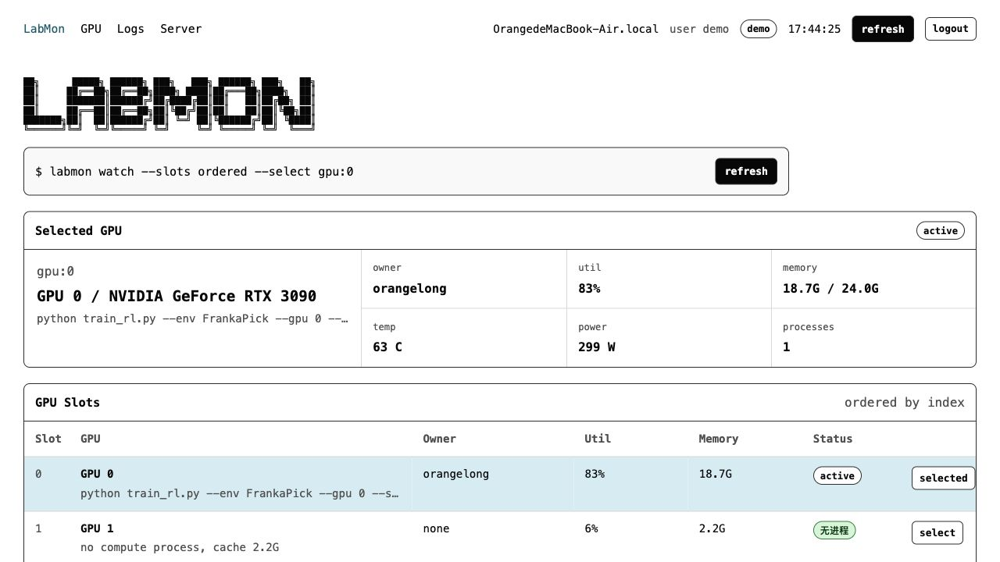
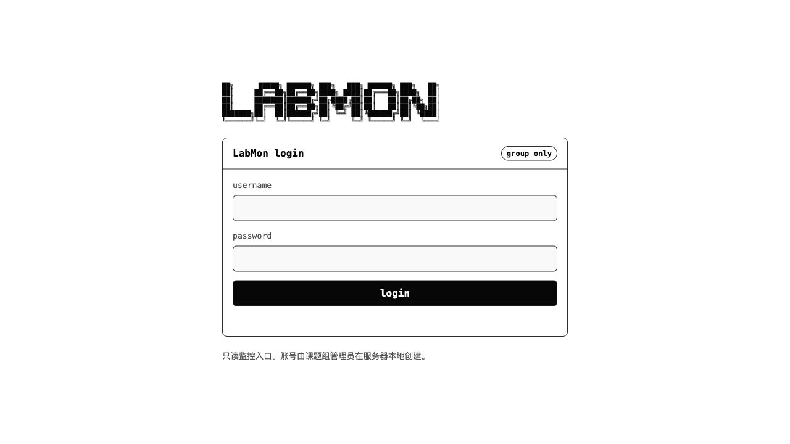

# LabMon

四卡 RTX 3090 服务器只读监控面板。本机可以先跑 demo，部署到服务器后切到真实 `nvidia-smi` 采集。它用来回答一个很具体的问题：现在每张卡是谁在用、跑的是什么、日志有没有继续推进。



## 功能

- 实时刷新 CPU、内存、磁盘、GPU 利用率、显存、温度、功耗。
- 按物理 GPU 顺序显示 `0,1,2,3`，点击任意卡查看详情。
- 通过 PID 关联 Linux 用户、命令行、启动时间、显存占用。
- 扫描训练日志，提取 `step`、`epoch`、`loss`、`reward`、`eta` 等进度字段。
- 内置登录系统，适合学校内网里只允许课题组成员访问。
- 只读设计，不提供 kill 进程或写入用户实验目录的能力。

## 登录

部署时设置 `LABMON_AUTH=1` 后，所有页面、静态资源和 API 都会要求登录。用户文件保存在服务器本地，密码只存 PBKDF2 hash。



## 本机 demo

```bash
uv sync --dev
LABMON_DEMO=1 uv run uvicorn labmon.app:app --reload --host 127.0.0.1 --port 8765
```

打开 <http://127.0.0.1:8765>。

如果想本机预览登录系统：

```bash
uv run python scripts/manage_users.py add demo
LABMON_DEMO=1 \
LABMON_AUTH=1 \
LABMON_AUTH_SECRET="$(openssl rand -hex 32)" \
uv run uvicorn labmon.app:app --reload --host 127.0.0.1 --port 8765
```

## 测试

```bash
uv run pytest
```

## 服务器运行

```bash
uv sync --no-dev
uv run python scripts/manage_users.py add alice
LABMON_LOG_ROOTS="/home/*/runs,/home/*/logs,/data/runs,/data/logs" \
LABMON_AUTH=1 \
LABMON_AUTH_SECRET="$(openssl rand -hex 32)" \
uv run uvicorn labmon.app:app --host 0.0.0.0 --port 8765
```

如果端口可能暴露到公网，建议绑定 `127.0.0.1`，再通过 SSH tunnel、Nginx basic auth 或学校 VPN 访问。通过 HTTPS 访问时建议设置 `LABMON_AUTH_COOKIE_SECURE=1`。

## 环境变量

- `LABMON_DEMO=1`：启用本机 demo，GPU/进程使用模拟四卡 3090 数据。
- `LABMON_LOG_ROOTS`：逗号分隔的日志目录或 glob。
- `LABMON_HOST_LABEL`：覆盖页面顶部显示的主机名。
- `LABMON_REFRESH_SECONDS`：前端刷新间隔，默认 1 秒；可设为 `0.5` 做更高频轮询。
- `LABMON_AUTH=1`：启用 LabMon 内置登录系统。
- `LABMON_AUTH_SECRET`：session 签名密钥。服务器部署必须设置，建议用 `openssl rand -hex 32` 生成。
- `LABMON_USERS_FILE`：用户文件路径，默认 `./labmon-users.json`，不要提交到 git。
- `LABMON_AUTH_SESSION_HOURS`：登录有效期，默认 168 小时。
- `LABMON_AUTH_COOKIE_SECURE=1`：通过 HTTPS 访问时开启 secure cookie。

## 用户管理

```bash
uv run python scripts/manage_users.py add alice
uv run python scripts/manage_users.py list
uv run python scripts/manage_users.py remove alice
```

密码只保存 PBKDF2 hash。建议每个组员单独账号，离组后删除对应账号。

## systemd 示例

见 `deploy/labmon.service`。部署时需要把 `WorkingDirectory` 改成服务器上的实际路径，并先在该目录执行 `uv sync --no-dev`。

## 数据来源

- demo 模式：读取本机 CPU/内存/磁盘，生成四张动态 mock RTX 3090 和示例训练日志。
- server 模式：通过 `psutil` 读取主机资源，通过 `nvidia-smi` 读取 GPU 和 compute process，再用 PID 关联系统用户与命令行。
- 日志：只读取 `LABMON_LOG_ROOTS` 扫描索引里的文件，避免任意路径读取。
