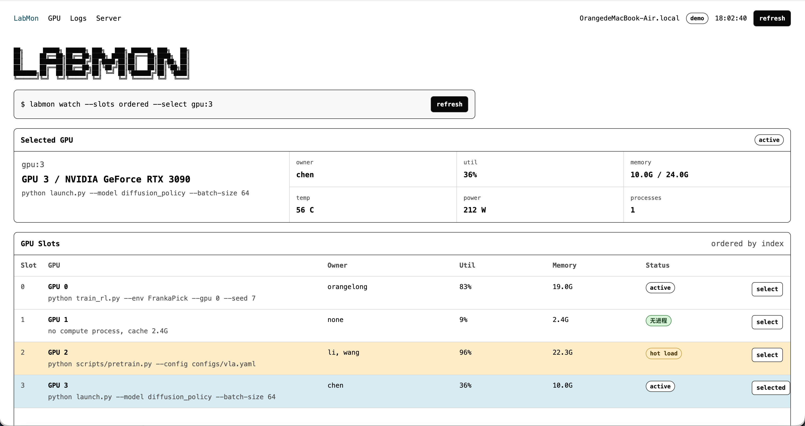
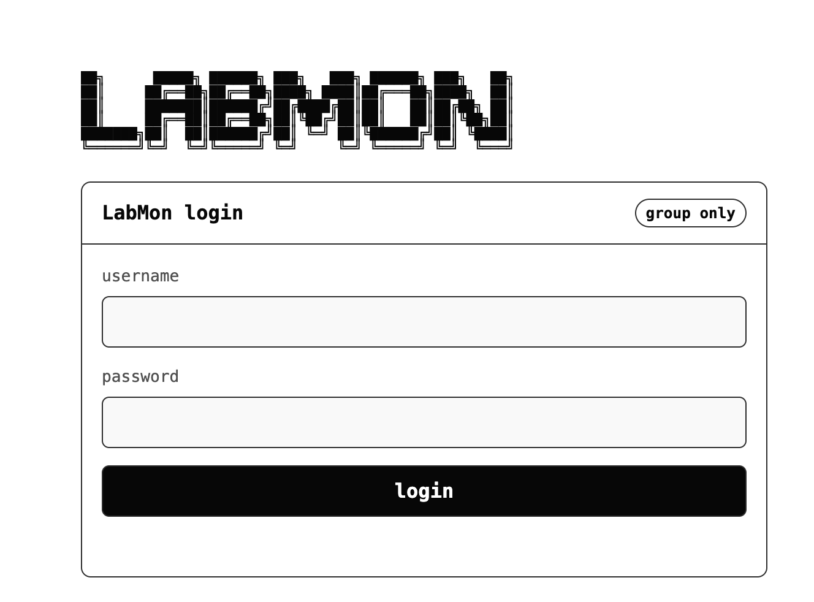

# LabMon

LabMon is a lightweight, read-only web dashboard for shared GPU servers in research labs. It helps a team answer the everyday questions before starting a run: which GPU is free, who is using the busy cards, what command is running, and whether recent training logs are still moving.



## Highlights

- Physical GPU order: cards are shown as GPU `0`, `1`, `2`, `3`, matching `nvidia-smi`.
- Per-GPU status: utilization, memory, temperature, power, owner, command line, process count, and start time.
- Host status: CPU, memory, disk, load average, free GPU count, and collector warnings.
- Training progress: scans configured log directories and extracts common fields such as `step`, `epoch`, `loss`, `reward`, `lr`, and `eta`.
- Built-in authentication: local users, PBKDF2 password hashes, signed HttpOnly sessions, and protected API/static routes.
- Read-only by design: no process killing, no scheduling, and no writes to users' experiment directories.

## Login

LabMon can run without authentication for local demos. For shared lab deployment, enable `LABMON_AUTH=1` so only group members with local LabMon accounts can access the dashboard.



## Quick Start

Install dependencies with `uv`:

```bash
uv sync --dev
```

Run a local demo with four mock RTX 3090 cards:

```bash
LABMON_DEMO=1 uv run uvicorn labmon.app:app --reload --host 127.0.0.1 --port 8765
```

Open <http://127.0.0.1:8765>.

To preview the login flow locally:

```bash
uv run python scripts/manage_users.py add demo
LABMON_DEMO=1 \
LABMON_AUTH=1 \
LABMON_AUTH_SECRET="$(openssl rand -hex 32)" \
uv run uvicorn labmon.app:app --reload --host 127.0.0.1 --port 8765
```

## Server Deployment

On a Linux GPU server with NVIDIA drivers installed:

```bash
uv sync --no-dev
uv run python scripts/manage_users.py add alice
LABMON_LOG_ROOTS="/home/*/runs,/home/*/logs,/data/runs,/data/logs" \
LABMON_AUTH=1 \
LABMON_AUTH_SECRET="$(openssl rand -hex 32)" \
uv run uvicorn labmon.app:app --host 0.0.0.0 --port 8765
```

The included `deploy/labmon.service` is a systemd template. Edit `WorkingDirectory`, `LABMON_USERS_FILE`, `LABMON_AUTH_SECRET`, and `ExecStart` for your server path before installing it.

If the port may be reachable outside your trusted network, bind LabMon to `127.0.0.1` and access it through an SSH tunnel, a VPN, or a reverse proxy with HTTPS. When serving over HTTPS, set `LABMON_AUTH_COOKIE_SECURE=1`.

## User Management

```bash
uv run python scripts/manage_users.py add alice
uv run python scripts/manage_users.py list
uv run python scripts/manage_users.py remove alice
```

Each user gets an independent account. Passwords are stored as PBKDF2 hashes in `LABMON_USERS_FILE`; the default file is `./labmon-users.json`, which is intentionally ignored by git.

## Configuration

| Variable | Default | Description |
| --- | --- | --- |
| `LABMON_DEMO` | unset | Set to `1` to use mock four-card RTX 3090 data. |
| `LABMON_LOG_ROOTS` | demo sample logs | Comma-separated directories or glob patterns to scan for logs. |
| `LABMON_HOST_LABEL` | system hostname | Overrides the host label shown in the header. |
| `LABMON_REFRESH_SECONDS` | `1` | Dashboard polling interval in seconds. |
| `LABMON_AUTH` | unset | Set to `1` to require login. |
| `LABMON_AUTH_SECRET` | unset | Required in auth mode; use `openssl rand -hex 32`. |
| `LABMON_USERS_FILE` | `./labmon-users.json` | Local user database path. |
| `LABMON_AUTH_SESSION_HOURS` | `168` | Session lifetime in hours. |
| `LABMON_AUTH_COOKIE_SECURE` | unset | Set to `1` when serving over HTTPS. |

## API

- `GET /api/snapshot`: complete dashboard snapshot with host, GPU, process, log, and warning data.
- `GET /api/logs/{log_id}?lines=200`: tail a discovered log file by whitelist ID.
- `GET /api/me`: current authenticated user when auth is enabled.
- `POST /api/login`: create a session.
- `POST /api/logout`: clear the session.

`/api/logs/{log_id}` only reads files discovered by the log scanner, so callers cannot pass arbitrary filesystem paths.

## Data Sources

In demo mode, LabMon reads real local CPU, memory, and disk data, then generates four dynamic mock RTX 3090 cards and sample training logs.

In server mode, LabMon uses `psutil` for host resources, `nvidia-smi` for GPU and compute-process data, and PID lookups to attach Linux user, command line, memory usage, and start time.

## Tests

```bash
uv run pytest
```

The test suite covers GPU CSV parsing, PID enrichment, missing/permission-denied collectors, log parsing, API behavior, and authenticated route protection.
